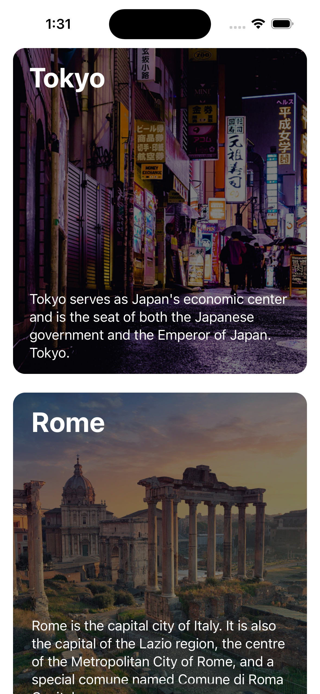
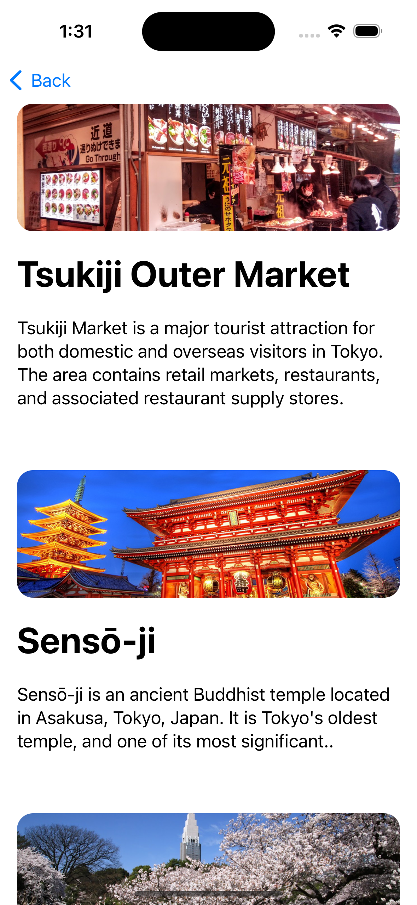
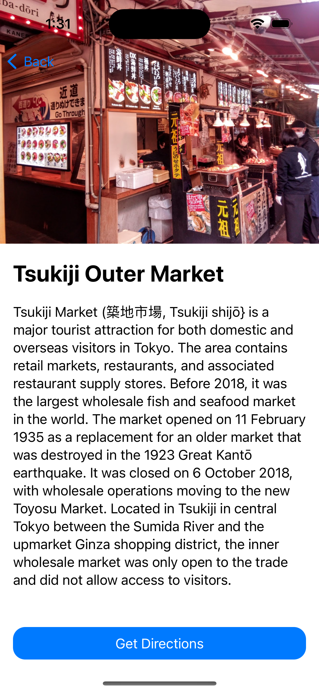
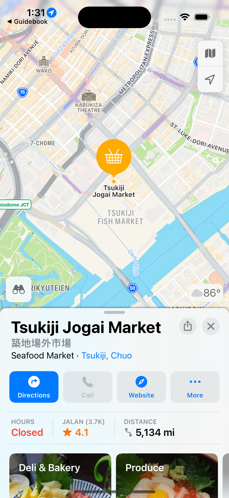

# Guidebook-App
An App that uses the Drilldown navigation pattern to show information about different places.

## Main view (Places)

## 2nd level view (Attractions)

## 3rd level view (Attraction Detail)

## 4rd level view (Attraction location in Map)
